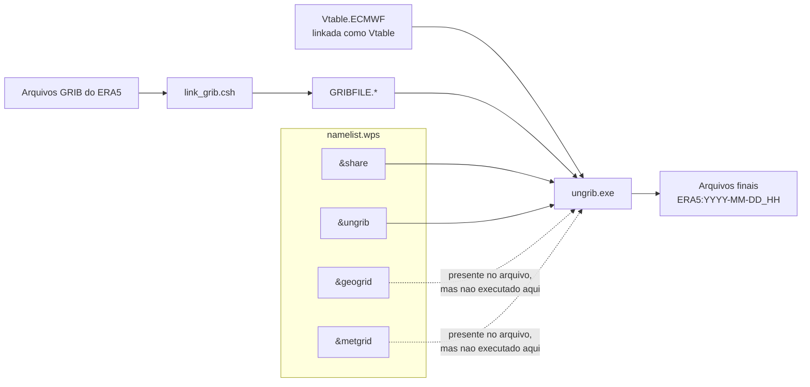

> Como visualizar este arquivo: use um visualizador de Markdown no seu editor ou IDE, visualize diretamente pelo GitHub, ou, se você não tiver um visualizador específico, copie e cole o conteúdo em uma destas opções: https://markdownlivepreview.com/, https://markdownlivepreview.dev/ ou https://stackedit.io/

# Tutorial WPS

Este tutorial explica como preparar dados do ERA5 para o `ungrib.exe` do WPS (WRF Pre-Processing System) e gerar arquivos no formato intermediário do WPS, que servem de entrada para o init_atmosphere do MONAN/MPAS para geração de IC/LBC, como:

```text
ERA5:2026-03-01_00
ERA5:2026-03-01_03
ERA5:2026-03-01_06
```

O objetivo aqui é entender o fluxo do WPS por si só.

## Diagrama do fluxo



Neste tutorial, o executável efetivamente rodado é o `ungrib.exe`. Por isso, os blocos mais diretamente usados no `namelist.wps` são `share` e `ungrib`. Os blocos `geogrid` e `metgrid` continuam presentes no arquivo para manter a estrutura esperada pelo WPS, mas não são executados neste fluxo.

## Visão geral do processo

Para converter os dados do ERA5 em arquivos intermediários do WPS, o fluxo é:

1. baixar os arquivos GRIB do ERA5;
2. preparar um diretório de trabalho do WPS;
3. configurar o arquivo `namelist.wps`;
4. escolher a `Vtable` correta;
5. executar `link_grib.csh`;
6. executar `ungrib.exe`;
7. verificar os arquivos de saída.

Os dois componentes mais importantes desse processo são:

- `link_grib.csh`, que cria links simbólicos padronizados para os arquivos GRIB;
- `ungrib.exe`, que lê os GRIBs e os converte para o formato intermediário do WPS.

## 1. Download do ERA5

Para o fluxo com `ungrib`, o ideal é baixar os dados do ERA5 em formato GRIB e separar os campos em dois grupos:

- dados em níveis de pressão;
- dados de superfície.

Isso é necessário porque o ERA5 distribui esses conjuntos de campos em produtos diferentes.

### Campos em níveis de pressão

Os campos atmosféricos típicos necessários são:

- `geopotential`
- `relative_humidity`
- `temperature`
- `u_component_of_wind`
- `v_component_of_wind`

### Campos de superfície

Os campos de superfície típicos são:

- `10m_u_component_of_wind`
- `10m_v_component_of_wind`
- `2m_dewpoint_temperature`
- `2m_temperature`
- `geopotential`
- `land_sea_mask`
- `mean_sea_level_pressure`
- `sea_ice_cover`
- `sea_surface_temperature`
- `skin_temperature`
- `snow_depth`
- `soil_temperature_level_1` a `soil_temperature_level_4`
- `surface_pressure`
- `volumetric_soil_water_layer_1` a `volumetric_soil_water_layer_4`

## 2. Preparação do diretório de trabalho do WPS

Crie um diretório de trabalho do WPS vazio para rodar o `ungrib`. Nesse diretório, você deve ter:

- o arquivo `namelist.wps`, que pode ser obtido no diretório raiz do WPS;
- o link ou cópia da `Vtable` específica (opções em /caminho/para/WPS/ungrib/Variable_Tables/);
- Os arquivos GRIB a serem processados (ERA5 ou GFS, por exemplo);
- O arquivo C shell `link_grib.csh` e o executável `ungrib.exe` que são obtidos no diretório raiz do WPS;
  
Um exemplo de preparação inicial seria:

```bash
mkdir -p /caminho/para/wps_work
cd /caminho/para/wps_work
ln -sf /caminho/para/WPS/ungrib/Variable_Tables/Vtable.ECMWF Vtable
ln -s /caminho/para/WPS/link_grib.csh link_grib.csh
ln -s /caminho/para/WPS/ungrib.exe ungrib.exe
cp /caminho/para/WPS/namelist.wps namelist.wps
```

## 3. Preparação do `namelist.wps`

O `ungrib.exe` é configurado a partir do arquivo `namelist.wps`.

Os pontos mais importantes desse arquivo, para o caso do `ungrib`, são:

- `start_date`
- `end_date`
- `interval_seconds`
- `prefix`

### O que cada item controla

- `start_date`: define o primeiro horário a ser processado;
- `end_date`: define o último horário a ser processado;
- `interval_seconds`: define o intervalo entre os arquivos que o `ungrib` espera encontrar em segundos;
- `prefix`: define o prefixo dos arquivos de saída.

Se os arquivos GRIB estiverem em passo de 3 horas, por exemplo, então `interval_seconds` deve ser `10800`.

### Exemplo mínimo de `namelist.wps`

```text
&share
 wrf_core = 'ARW',
 max_dom = 1,
 start_date = '2026-03-01_00:00:00',
 end_date   = '2026-03-05_21:00:00',
 interval_seconds = 10800,
/

&geogrid
 parent_id         = 1,
 parent_grid_ratio = 1,
 i_parent_start    = 1,
 j_parent_start    = 1,
 e_we              = 10,
 e_sn              = 10,
 dx = 1.0,
 dy = 1.0,
 map_proj = 'lat-lon',
 ref_lat   = 0.0,
 ref_lon   = 0.0,
 truelat1  = 0.0,
 truelat2  = 0.0,
 stand_lon = 0.0,
 geog_data_path = '/tmp',
 geog_data_res  = 'default',
 opt_output_from_geogrid_path = './',
/

&ungrib
 out_format = 'WPS',
 prefix = 'ERA5',
/

&metgrid
 fg_name = 'FILE',
/
```

Nesse contexto, os blocos `geogrid` e `metgrid` estão presente apenas para satisfazer o formato do `namelist.wps`. Estes dois blocos são utilizados para, respectivamente, criar o domínio do WRF e interpolar a IC e LBC no domínio gerado. Já o campo `ungrib` é importante para executar a etapa do "desgribar" o dado, e `share` é compartilhado entre os diferentes executáveis de pré-processamento do WRF.

## 4. Entendendo o papel da `Vtable`

Antes de executar o `ungrib`, é importante entender a `Vtable`.

A `Vtable` funciona como uma [tabela de tradução](https://www2.mmm.ucar.edu/wrf/users/wrf_users_guide/build/html/wps.html#creating-and-editing-vtables) entre:

- os códigos e níveis presentes no arquivo GRIB;
- os nomes de variáveis que o WPS entende internamente.

Em outras palavras, ela informa ao `ungrib`:

- quais campos devem ser lidos;
- em que níveis esses campos estão;
- para quais nomes internos do WPS cada campo deve ser convertido.

Sem a `Vtable` correta, o `ungrib` pode:

- deixar de reconhecer campos importantes;
- mapear variáveis para nomes errados;
- gerar arquivos finais incompletos ou inconsistentes;
- falhar durante a execução.

No caso do ERA5, a tabela correta é a `Vtable.ECMWF`.

Ela deve estar presente no diretório de trabalho do WPS com o nome exato `Vtable`. Isso normalmente é feito com um link simbólico:

```bash
ln -sf /caminho/para/WPS/ungrib/Variable_Tables/Vtable.ECMWF Vtable
```

## 5. Execução do `link_grib.csh`

O `link_grib.csh` não converte dados. Ele apenas cria links simbólicos com nomes padronizados:

- `GRIBFILE.AAA`
- `GRIBFILE.AAB`
- `GRIBFILE.AAC`
- ...

O `ungrib.exe` lê esses links em vez dos nomes originais dos arquivos.

Os arquivos GRIB mencionados aqui são justamente os arquivos baixados do ERA5 na seção 1, tanto os campos em níveis de pressão quanto os campos de superfície.

Se esses arquivos GRIB do ERA5 estiverem em outro diretório, a execução típica é:

```bash
/caminho/para/WPS/link_grib.csh /caminho/para/gribs/*.grib
```

Depois disso, o diretório de trabalho do WPS onde foi executado o comando acima passa a conter os arquivos `GRIBFILE.*`.

## 6. Execução do `ungrib.exe`

O `ungrib.exe` lê:

- os `GRIBFILE.*`;
- o `namelist.wps`;
- a `Vtable`.

Por isso, o `ungrib.exe` deve ser executado no mesmo diretório onde os arquivos `GRIBFILE.*` foram criados e onde também estão o `namelist.wps` e a `Vtable`.

Essa é a razão de ser recomendável concentrar todo esse processo em um diretório separado, chamado aqui de diretório de trabalho do WPS.

E então o `ungrib.exe` converte os GRIBs para o formato intermediário do WPS, que serão utilizados como entradas para o `init_atmosphere` do MONAN/MPAS para criação de IC e LBC.

A execução típica é:

```bash
cd /caminho/para/wps_work
./ungrib.exe
```

Se tudo estiver correto, os arquivos de saída terão nomes como:

```text
ERA5:2026-03-01_00
ERA5:2026-03-01_03
ERA5:2026-03-01_06
```

Esses são os arquivos finais deste tutorial.

## 7. Como verificar se deu certo

Sinais de que o processo funcionou:

- existem arquivos com o prefixo definido, por exemplo `ERA5:2026-03-01_00`;
- a quantidade de arquivos finais acompanha a quantidade de horários solicitados;
- os horários dos arquivos gerados cobrem todo o intervalo entre `start_date` e `end_date`.

## 8. Erros comuns

### `Vtable` errada

Se a `Vtable` não for compatível com o ERA5, o `ungrib` pode não reconhecer os campos corretamente.

### Datas inconsistentes no `namelist.wps`

Se `start_date`, `end_date` e `interval_seconds` não combinarem com a sequência real dos GRIBs, o `ungrib` pode falhar ou gerar saídas incompletas.

### Falta de arquivos GRIB

Se algum horário estiver ausente, a sequência esperada pelo `ungrib` fica quebrada.

### Diretório de trabalho incompleto

Se faltar o `namelist.wps`, a `Vtable` ou os `GRIBFILE.*`, o `ungrib.exe` não terá os insumos necessários para rodar corretamente.
